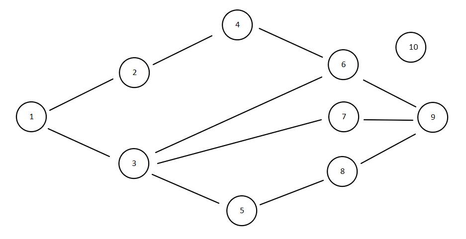

# SocialNetwork

### Build and Run
1. Download or clone the repo
1. `mvn clean compile exec:java`
1. Follow the input prompts
1. Tests can be run using `mvn clean install`

### Test case
The following graph was used to test the algorithm:

- Optimal path from node 1 to node 9 was calculated.
- Result was compared with the brute force approach.
- Repeated 1000 times with each user's skill randomised each time.
- Node 10 used to test the case when path doesn't exist.
